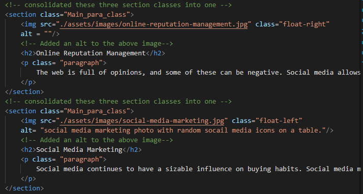

# 01-HTML-Git-CSS-Homework
The point of this assignment was to update the html and css files provided to be more accessible. 

## Major Changes
* Added alt tags to every image.
  * described each image as accurately as possible.
* Consolidated CSS classes that were similar.
* Changed some class names be easier to understand.
* Changed the header from Div to header.
* Changed the section's from div to section.

## The following image shows a snippet of the code and comments that I made. 
